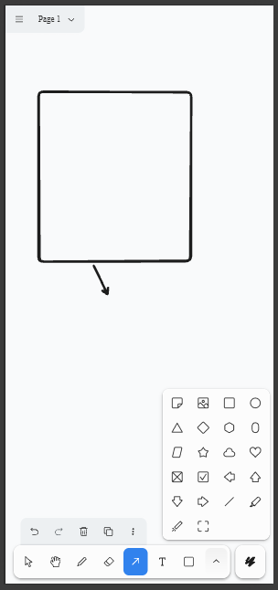

# Traccar Whiteboard 🎨

Uma lousa digital (whiteboard) infinita, simples, limpa e extremamente rápida, desenvolvida com o motor **tldraw** e integrada ao ecossistema Expo. 

Este projeto foi simplificado ao máximo para oferecer um espaço de desenho limpo e focado, ideal para criação de diagramas, fluxogramas, anotações visuais e prototipação livre.

---

## 🚀 Como Iniciar o Projeto

### Pré-requisitos
Certifique-se de ter o [Node.js](https://nodejs.org/) e o gerenciador de pacotes [pnpm](https://pnpm.io/) instalados em sua máquina.

### 1. Instalar as Dependências
Execute o comando a seguir na raiz do projeto:
```bash
pnpm install
```

### 2. Executar no Navegador (Web)
Para rodar a aplicação localmente em ambiente Web, execute:
```bash
pnpm web
```

Isso abrirá o servidor de desenvolvimento e você poderá acessar a lousa em `http://localhost:8081`.

---

## 🎨 Como Usar a Lousa Digital

A interface do **tldraw** oferece uma ampla gama de ferramentas de edição no painel inferior e lateral. Abaixo está uma imagem demonstrando o layout e as funcionalidades disponíveis:



### Principais Recursos:
- **Ferramenta de Caneta/Lápis**: Desenho livre com espessuras e cores personalizáveis.
- **Formas Geométricas**: Adicione retângulos, elipses, triângulos e setas de fluxo de trabalho.
- **Notas Autoadesivas (Sticky Notes)**: Crie anotações rápidas e organize suas ideias em blocos de cor.
- **Ferramenta de Texto**: Digite e formate blocos de texto diretamente no canvas.
- **Setas e Conectores**: Crie diagramas conectando formas que se ajustam dinamicamente ao serem movidas.
- **Importação/Exportação**: Exporte seus desenhos para formatos de imagem tradicionais ou salve o projeto localmente.

---

## 📂 Estrutura Simplificada do Projeto

O repositório foi limpo de todo código desnecessário e legados complexos para manter-se minimalista:

```text
├── src/
│   ├── app/
│   │   ├── _layout.tsx         # Configuração básica de rotas (Slot)
│   │   └── index.tsx           # Tela principal renderizando a lousa em tela cheia
│   └── components/
│       └── whiteboard-canvas.tsx # Canvas wrapper do tldraw ('use dom')
├── assets/
│   ├── image.png               # Imagem ilustrativa de uso (README)
│   └── images/                 # Ícones de aplicação e splash
└── metro.config.js             # Configurações do Metro Bundler (com suporte a pnpm)
```
  
# tldraw  
